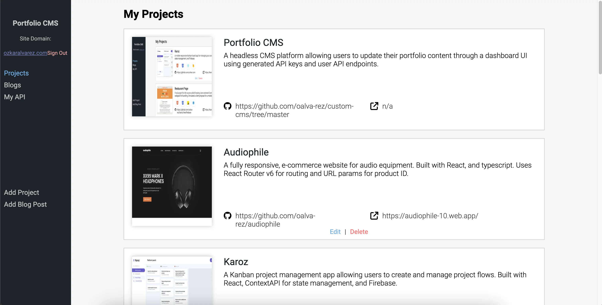
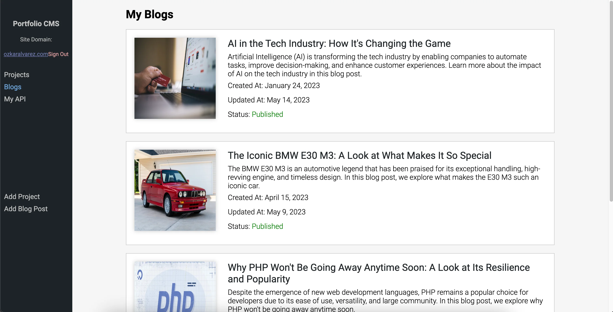
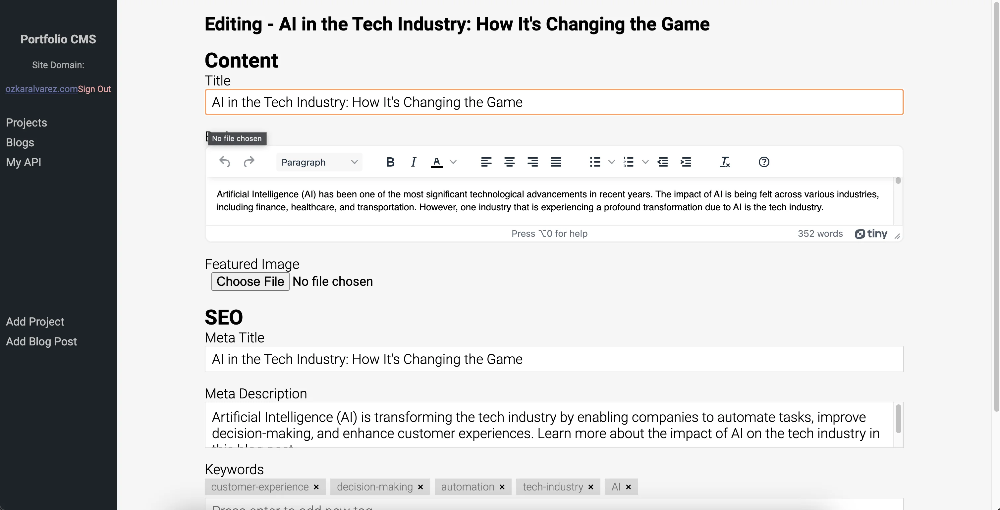
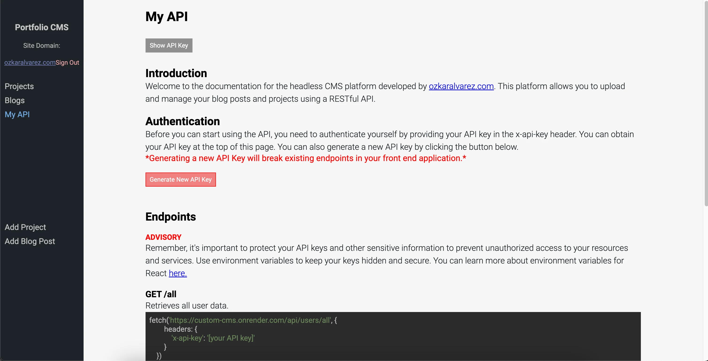

# Portfolio CMS Frontend

Welcome to the repository for my headless CMS frontend application. This React.js application is designed to provide an intuitive and efficient content management system tailored to manage portfolio content and blog posts. Its robust functionality caters to the needs of content creators and developers alike.

## Key Features
* **User API Key Generation:** Users can generate unique API keys, enabling secure and personalized access to their content.
* **Custom User Endpoints:** Create and manage custom endpoints for streamlined content delivery.
* **Project Management:** Add, edit, and delete portfolio projects with ease. Integrates AWS S3 for reliable and convenient image uploads.
* **Blog Post Management:** Craft and manage blog posts, with features to add, edit, draft, and publish. Includes SEO metadata functionality for enhanced online visibility.
* **User API Documentation:** Comprehensive documentation provided for users to effectively utilize the API, enhancing user experience and ease of use.

## How It Works

* **React.js Frontend:** Utilizes React.js for a dynamic and interactive user interface. The frontend is designed to provide a seamless user experience, facilitating easy navigation and content management.

* **Node.js Backend Integration:** The application's backend is powered by a [Node.js application](https://github.com/oalva-rez/portfolio-cms-api), ensuring smooth data processing and API management. This integration forms the backbone of the application's functionality.

* **User Authentication:** Implements a secure authentication system where users can sign up and log in using their email and password. This feature ensures that access to the CMS is restricted to authorized users only, safeguarding user data and content integrity.

* **AWS S3 Image Upload:** The application integrates AWS S3 for image uploading, providing a reliable and efficient solution for storing and retrieving images associated with projects and blog posts.
  
* **MongoDB Database:** All user data, including project and blog post details, are securely stored and managed in a MongoDB database. This NoSQL database choice allows for flexible data handling and scalability.

## Screenshots
### User Projects List
Explore the Dashboard's Projects tab, where users can view a comprehensive list of all their created projects.

  

### Edit Project
Here, users can modify project information, adjust settings, and upload new images.

### User Blog Posts
Each entry is displayed with essential details, allowing for easy management and review of your published and draft articles.

  

### Edit Blog Post
Users can toggle between draft and published status, fine-tuning their posts for the perfect launch. The added functionality to insert SEO metadata empowers users to optimize their content for better search engine visibility and reach.

  

### User API documentation
This section not only guides on effective API utilization but also provides the functionality to generate new API keys, ensuring secure and tailored access to user-specific data.

  

